# Dashma

A minimal, zen-inspired link dashboard homepage. Fast, lightweight, and fully configurable.


---

## ✨ Features

### 🎨 Beautiful & Minimal
Dashma embraces the Japanese concept of "Ma" (間) - the beauty of negative space. A clean, distraction-free interface that lets your links breathe.

### ⌨️ Keyboard-First Navigation
Navigate entirely with your keyboard:
- `/` to search instantly
- `1-9` to jump to categories
- Arrow keys + Enter to select

### 🗂️ Smart Organization
- **Categories** - Group links into collapsible sections
- **Tags** - Add tags to links for quick filtering
- **Multiple Views** - Display as cards or minimal text links

### 🎛️ Fully Customizable
- Flexible column layouts (1-6 columns)
- Custom colors, fonts, and backgrounds
- Hover animations and visual effects
- Favicon support with auto-fetching

### 🔐 Flexible Authentication
- **Public** - No login required
- **Basic Auth** - Simple username/password
- **Microsoft Entra ID** - Enterprise SSO with guided setup wizard

### 🛠️ Admin Panel
Everything is configured through a web GUI at `/admin` - no config files to edit. Export and import your configuration as JSON for easy backup.

---

## 🚀 Quick Start

### Using Docker (Recommended)

```bash
docker-compose up -d --build
```

### Using Docker with Nginx

```bash
docker-compose -f docker-compose.nginx.yml up -d --build
```

### Development Mode

```bash
npm install
npm run dev
```

---

## 🔗 Access

| URL | Description |
|-----|-------------|
| `http://localhost:3000` | Homepage |
| `http://localhost:3000/admin` | Admin Panel |

**Default credentials:** `admin` / `admin` (password change required on first login)

---

## ⌨️ Keyboard Shortcuts

| Key | Action |
|-----|--------|
| `/` | Open search |
| `Esc` | Close search/modals |
| `1-9` | Jump to category |
| `↑` `↓` | Navigate results |
| `Enter` | Open selected link |

---

## 🏗️ Tech Stack

| Layer | Technology |
|-------|------------|
| Frontend | Vanilla HTML, CSS, JavaScript |
| Backend | Node.js + Fastify |
| Storage | JSON file persistence |
| Auth | MSAL for Microsoft Entra ID |
| Deploy | Docker + Nginx |

---

## 📁 Project Structure

```
dashma/
├── src/
│   ├── public/          # Frontend (HTML, CSS, JS)
│   ├── server/          # Backend (Fastify, routes, auth)
│   └── data/            # Persisted configuration
├── docker-compose.yml
└── nginx.conf
```

---

## Screenshots

### Dashboard

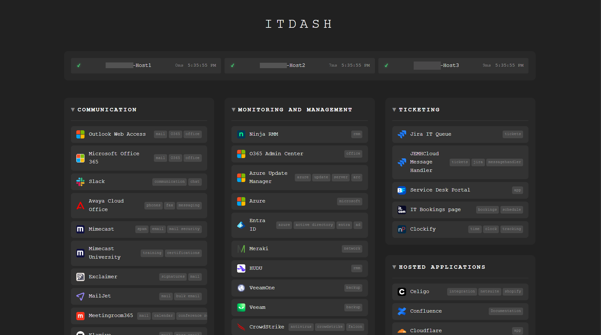

### Admin Login

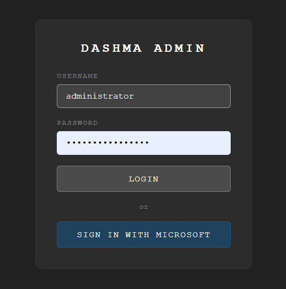

### Search

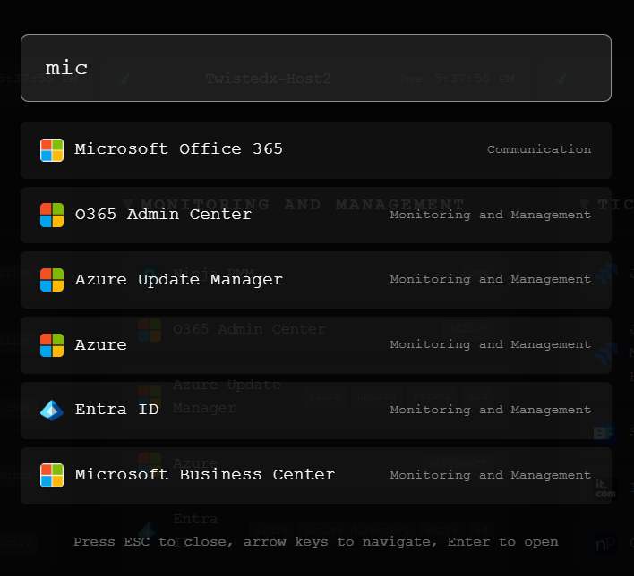

### Admin Panel

**Appearance** - Customize colors, layout, typography, animations, and background images.

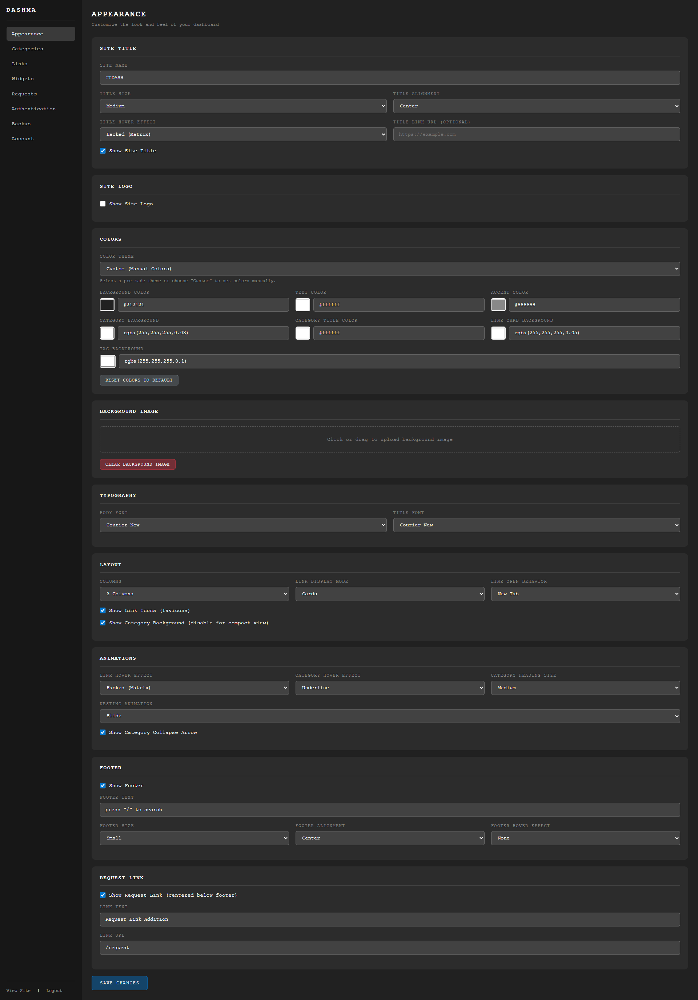

**Categories** - Organize your links into drag-and-drop sortable categories.

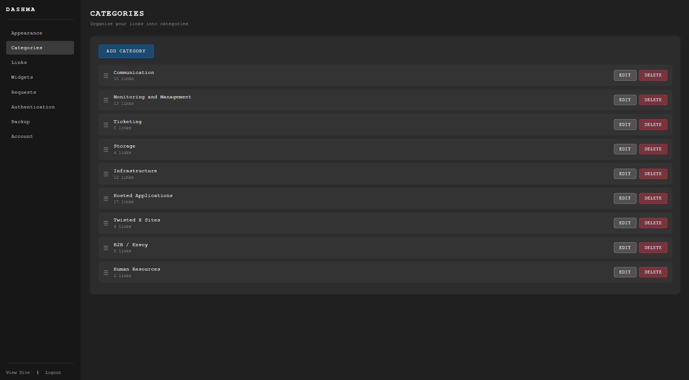

**Links** - Manage links within each category with tags, favicons, and sorting.

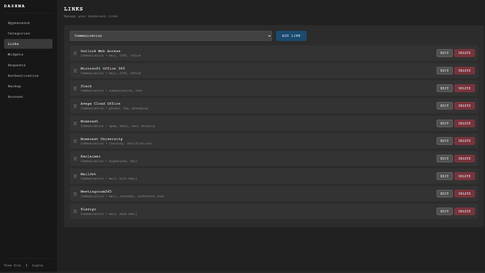

**Widgets** - Add and configure dashboard widgets like server monitors.

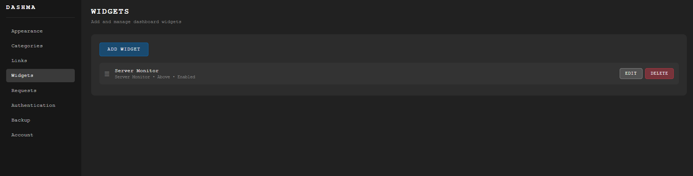

**Requests** - Review and approve user-submitted category and link requests.

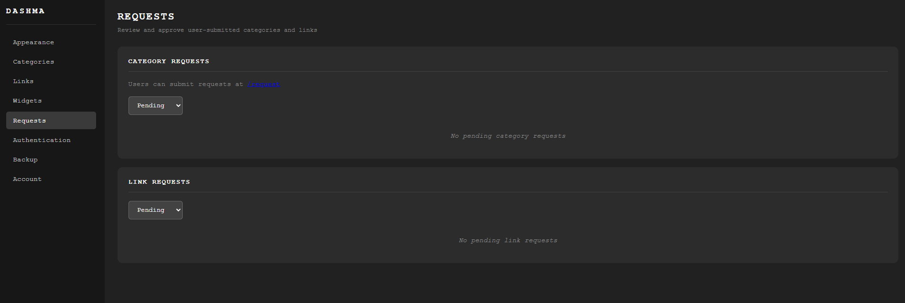

**Authentication** - Configure admin and site auth including Microsoft Entra ID SSO.

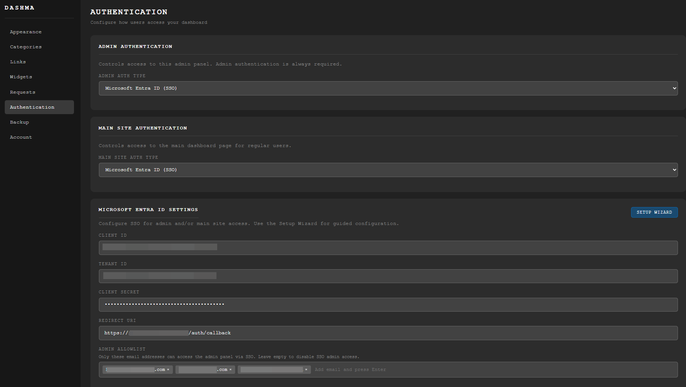

**Backup** - Export and import your full configuration as JSON.

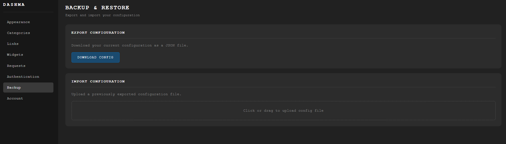

**Account** - Manage admin credentials.

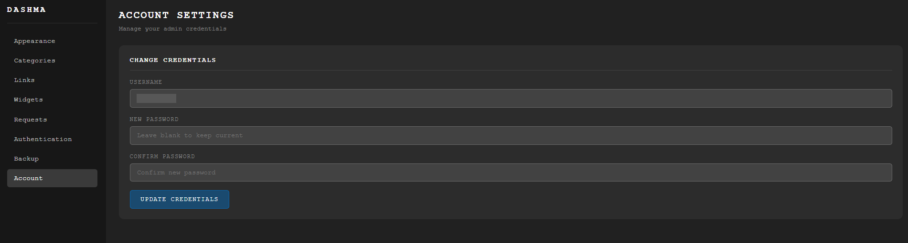

---

## 📄 License

MIT License - see [LICENSE](LICENSE) for details.

